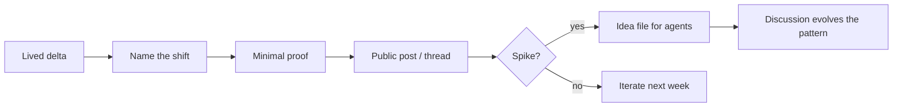

# AK.skill — Agent-era idea literacy (Cursor skills)

## The problem

You ship a correct insight and it still dies: the post is too polished to feel true, or too vague to spread, or the “repo drop” lands as **noise** because everyone’s stack differs. In the agent era, the scarce artifact is often not code—it is a **pattern your agent can instantiate**. Without a repeatable release path, you re-learn the same presentation mistakes on every launch.

> The failure mode is not “bad writing.” It is **missing a compression step**: a handle for the shift, a proof small enough to verify, and a handoff file that survives the hype cycle.

## The solution

**AK.skill** packages **one entry skill** plus **seven checklists** for Cursor (or any agent workflow) when you are publishing a technical idea. **Start with `/ak`** in Agent chat; it routes you to the right module.

| Skill | Folder | What it fixes |
| ----- | ------ | ------------- |
| **AK.skill (entry)** | `skills/ak/` | High-level router: default thread pipeline + branches for teaching, scoreboard loops, year reviews |
| Paradigm Surface | `skills/paradigm-surface/` | Lived workflow change + name the abstraction (+ optional metaphor / era label) |
| Proof in Miniature | `skills/proof-in-miniature/` | Strong claim + smallest falsifiable artifact + “bare bones” framing |
| Idea File Handoff | `skills/idea-file-handoff/` | Attention → agent-readable spec; Discussions + deep links |
| Hype–Discipline Pairing | `skills/hype-discipline-pairing/` | Limits, verification habits, paradox, eval skepticism |
| Irreducible Core | `skills/irreducible-core/` | “Cannot simplify further” + single-file/gist pedagogy + commit-granular twin |
| Scoreboard Loop | `skills/scoreboard-loop/` | Cheap metric + mutable workspace + agent iteration template |
| Stack Year Review | `skills/stack-year-review/` | Stack before/after, notable list, tensions, TL;DR |

## Ground truth (micro-story)

**[Builder]** ships an internal memo: “agents changed how we code.” Engagement is flat—reads like every other slide. They rewrite the opening to a **two-week personal delta** (“I stopped editing functions; I started editing *policies* for agents”), add **one label** for the shift, and link a **20-line script** that proves the loop once. A noisy thread follows. Instead of dumping a private `.cursor` folder, they publish a **gist-style idea file**: headings, constraints, and a paste block for *any* agent. The idea forks without the repo becoming support hell.



## Quickstart (one copy-paste block)

```bash
# Clone into a workspace (adjust path)
git clone https://github.com/ERerGB/AK.skill.git ~/AK.skill
cd ~/AK.skill

# Install into Cursor user skills (merge; does not delete existing skills)
mkdir -p ~/.cursor/skills
for s in ak paradigm-surface proof-in-miniature idea-file-handoff hype-discipline-pairing irreducible-core scoreboard-loop stack-year-review; do
  cp -R "skills/$s" ~/.cursor/skills/
done

# Re-run anytime you pull updates — same paths overwrite cleanly
```

In chat: type **`/ak`** for the top-level entry, or reference a path e.g. `~/.cursor/skills/idea-file-handoff/SKILL.md`.

### Why `/` might not list a skill (Cursor)

- Each `SKILL.md` must start with YAML **frontmatter**: `name` (lowercase, hyphens) and `description` (non-empty). Without it, Cursor often **does not index** the skill for `/` or automatic discovery.
- After installing or changing skills, **fully restart Cursor** (or Reload Window) so the index refreshes.
- Invoke with the **`name` field** or folder name, e.g. **`/ak`**, `/paradigm-surface`, `/idea-file-handoff`. Check **Settings → Rules → Agent Decides** to confirm the skill appears.
- **Symlinks** to skill folders were unreliable in older Cursor builds; prefer **Cursor 2.5+**, or use `cp -R` into `~/.cursor/skills/` if discovery still fails.

## X / Tweet workflow

| File | Purpose |
| ---- | ------- |
| `tweet.config.yaml` | Parameterized slots (`post`, `article`, `comment`) for tweet-skill style workflows |
| `doc/narrative-core.md` | Single source of truth paragraph for mission checks |
| `doc/x-thread-starter.md` | Thread-shaped draft; put the **link in the last tweet** when promoting the repo |
| `doc/public-corpus-index.md` | Table of **public** sources useful for tone/structure research (not copied content) |
| `doc/skills-auditor.md` | Register this repo’s `skills/` tree with **skills-auditor** (dedupe + route + drift) |
| `config/skills-auditor.ak.env` | Env snippet for `SKILLS_AUDITOR_EXTRA_ROOTS` |

## References and prior art

| Concept | Reference | Relation to this repo |
| ------- | --------- | --------------------- |
| Idea file (spec over repo dump) | [Gist — LLM Wiki / idea file pattern](https://gist.github.com/karpathy/442a6bf555914893e9891c11519de94f) | **Idea File Handoff** |
| Vibe coding (named workflow) | Public coinage and discussion on X, 2025 | **Paradigm Surface** — label the abstraction |
| Year-in-review shape | [2025 LLM Year in Review](https://karpathy.bearblog.dev/year-in-review-2025/) | **Stack Year Review** |
| Irreducible single-file teaching | [microgpt post](https://karpathy.github.io/2026/02/12/microgpt/) | **Irreducible Core** |
| Commit-level curriculum | [build-nanogpt](https://github.com/karpathy/build-nanogpt) | **Irreducible Core** companion pattern |
| Software era framing | [YC AI Startup School talk](https://www.youtube.com/watch?v=LCEmiRjPEtQ) (+ [Software 2.0 essay](https://karpathy.medium.com/software-2-0-a64152b37c35)) | **Paradigm Surface** optional accelerators |
| Agentic optimization loop | [autoresearch](https://github.com/karpathy/autoresearch) (public repo) | **Scoreboard Loop** |
| Agent orchestration surface | MCP, IDE integrations, tool permissions | **Paradigm Surface** inventory style |

**Disclaimer:** This is an **independent literacy pack** inspired by recurring **public** patterns in how prominent engineers publish and teach. It is **not** affiliated with or endorsed by any individual; use it as a template, not impersonation. For primary sources, see `doc/public-corpus-index.md`.

## Repository layout

```
skills/
  ak/SKILL.md
  paradigm-surface/SKILL.md
  proof-in-miniature/SKILL.md
  idea-file-handoff/SKILL.md
  hype-discipline-pairing/SKILL.md
  irreducible-core/SKILL.md
  scoreboard-loop/SKILL.md
  stack-year-review/SKILL.md
doc/
  narrative-core.md
  x-thread-starter.md
  public-corpus-index.md
  skills-auditor.md
config/
  skills-auditor.ak.env
tweet.config.yaml
LICENSE
```

## License

MIT — see `LICENSE`.
